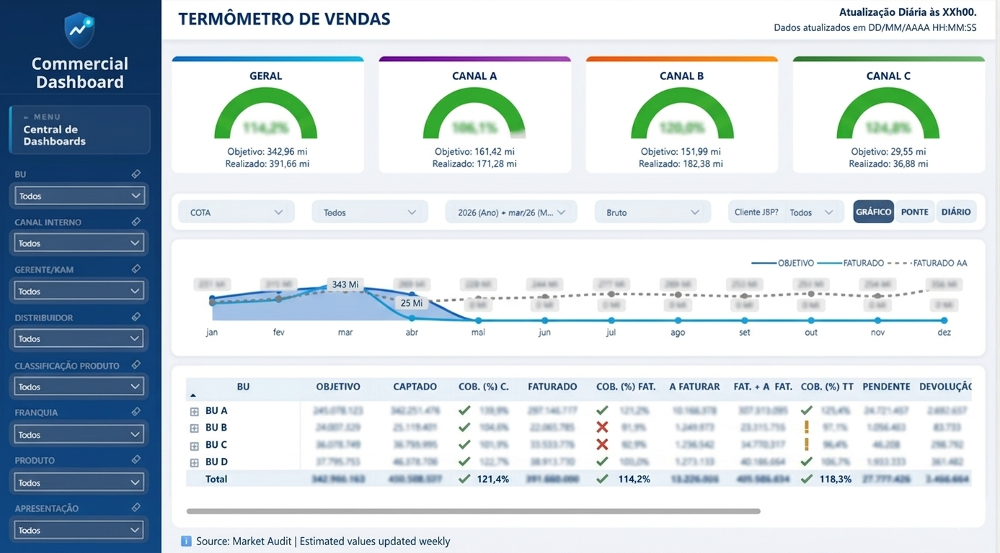
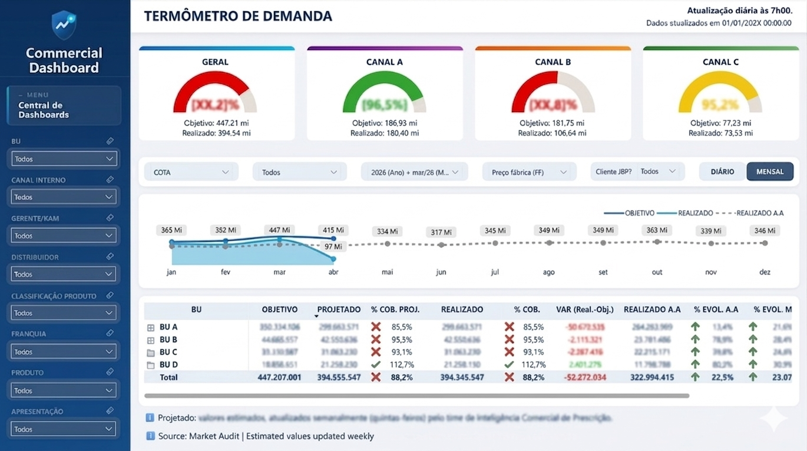
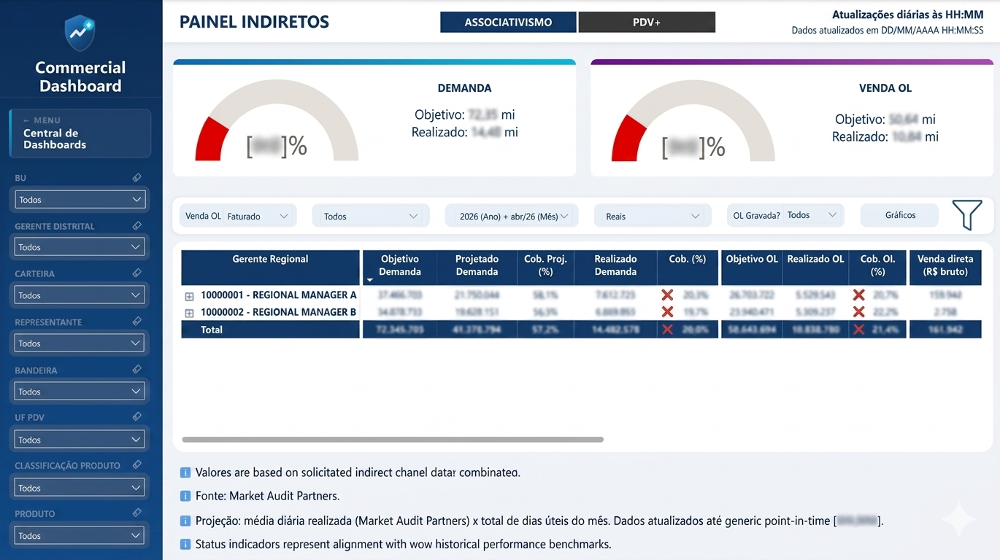
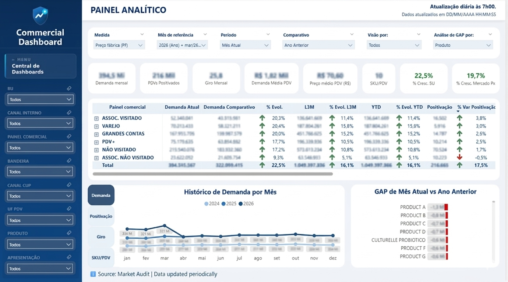

# 📊 Pharma Sales Intelligence

End-to-end commercial analytics platform for a multi-business-unit pharmaceutical company.
Built on **Databricks (Spark SQL / Delta Lake)** as the data warehouse and **Power BI** as the BI layer, serving hundreds of users across 4 business units.

> ⚠️ All queries and measures use anonymized or structural logic only. No real customer, patient, or proprietary commercial data is included.

---

## 🎯 Overview

A fully integrated commercial dashboard covering the pharmaceutical sell-out chain — from market audit data (Close-Up/CDD) through indirect sales channels and internal sell-in pipeline tracking.

Designed for national, district, and regional managers across 4 business units, with role-based filtering and multi-metric switching (Units / Net Revenue).

---

## 📑 Dashboard Modules

| Module | Description |
|---|---|
| **Sell-Out** | Market sell-out from pharmacy audit (CDD/Close-Up): demand, projection, L3M trend, YoY |
| **Sell-In** | Internal billing pipeline: pending orders, invoiced, to-be-billed with daily snapshot history |
| **Indiretos** | Indirect sales channel: PDV+ and Associativismo panels with quota vs. realized tracking |
| **Painel Analítico** | Cross-module analytical view: sell-out × sell-in reconciliation, coverage, demand planning |

---

## 🏗️ Architecture
Market Audit (Close-Up/CDD)  +  SAP (ERP)  +  Internal Planning
↓
Databricks Delta Lake
Bronze → Silver → Gold
↓
Power BI (Import Mode + Incremental Refresh)
↓                        ↓
Pharma Sales Intelligence     Analytical Panel
(operational dashboard)       (strategic view)

---

## 🔑 Key Technical Highlights

**Data Engineering (Spark SQL)**
- **DELETE + INSERT rebuild** strategy for monthly sell-out Gold table — justified by audit data retroaction
- **4-source UNION ALL** pipeline with origin tagging (`tabela_origem`, `canal_origem_info`) for data lineage
- **Idempotent incremental load** via `NOT EXISTS` — prevents duplicate snapshots on reprocessing
- **Inline VALUES mapping table** for SAP code adjustment — avoids auxiliary table for static mapping
- **Anti-duplication filter** via `NOT IN (SELECT DISTINCT months)` when integrating adhoc history with consolidated data
- **ROW_NUMBER() deduplication** for CNPJs appearing across multiple commercial sectors
- **INTERSECT-based overlap detection** between PDV+ and Associativismo panels
- **5-CTE revenue classification pipeline**: filter → profit center → BU → market → financial metrics
- `is_venda` flag computed once and reused across 6 financial columns

**DAX Modeling (Power BI)**
- **TREATAS double injection** (SKU flags + panel CNPJs) resolving many-to-many without physical relationship
- **Versioned panel snapshot**: dynamically resolves `dt_mes_base` to the correct panel version per selected month
- **Data lag detection**: automatically identifies whether prior month has arrived in the monthly fact table
- **Close-Up anchored projection**: extrapolates current month using business days ratio — anchored to audit cutoff date, not `TODAY()`
- **L3M Year-over-Year with fallback**: replaces only the missing month with projection, preserving the other 2 as realized
- **REMOVEFILTERS + KEEPFILTERS** pattern for historical snapshot isolation (pending orders)
- **Narrative analytics via DAX**: auto-generated executive insight text combining KPIs dynamically

---

## 🗂️ Repository Structure
pharma-sales-intelligence/
│
├── sql/
│   ├── gold/
│   │   ├── fato_sellout_historico_mensal.sql   # Monthly sell-out Gold rebuild
│   │   └── dim_painel_comercial_indiretos.sql  # Indirect sales panel dimension
│   └── pipelines/
│       └── incremental_load_historico.sql      # Idempotent daily snapshot load
│
└── dax/
├── 01_sellin_medidas.dax                   # Sell-in: pending orders snapshot pattern
├── 02_sellout_medidas.dax                  # Sell-out: L3M, projection, Close-Up anchor
└── 03_indiretos_medidas.dax                # Indirect: TREATAS + versioned panel

---

## 🛠️ Stack

| Layer | Technology |
|---|---|
| Data Warehouse | Databricks / Delta Lake |
| Query Language | Spark SQL |
| BI Tool | Power BI (Import Mode) |
| DAX | Advanced measures & modeling |
| Data Modeling | Star Schema |
| Source Systems | SAP ERP, Close-Up/CDD Market Audit |
| Version Control | GitHub |

---

## 📦 Business Units Covered

| BU | Therapeutic Area |
|---|---|
| BU Prescrição | Prescription drugs |
| BU Genéricos | Generic drugs |
| BU Oftalmologia | Ophthalmology |
| BU Dermatologia | Dermatology & aesthetics |

## 🖼️ Screenshots

